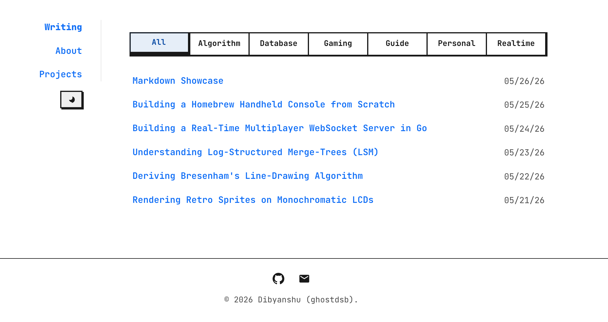
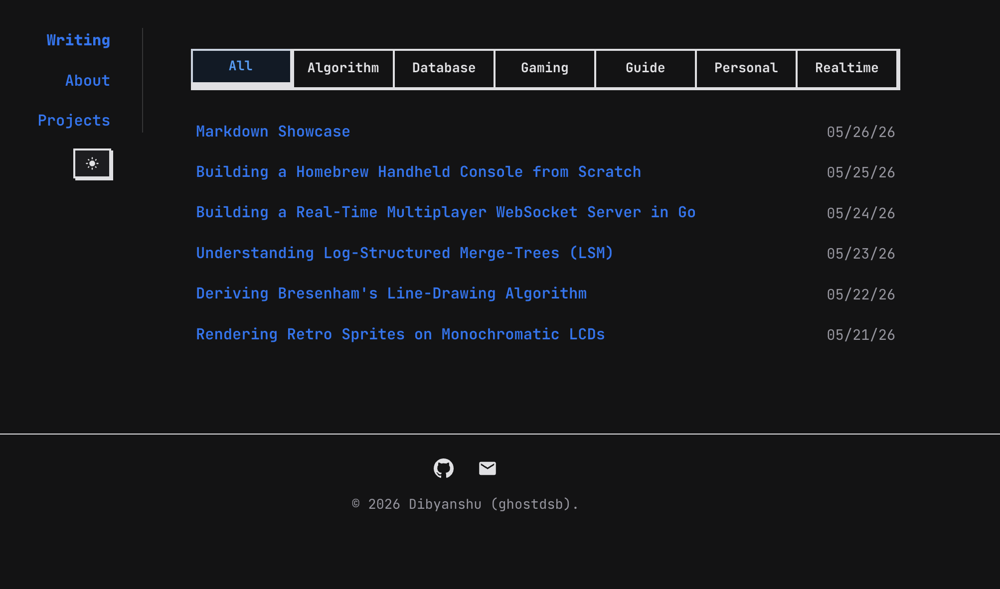
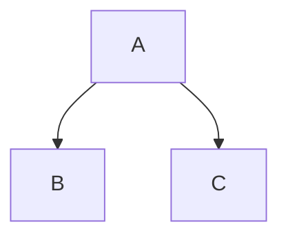
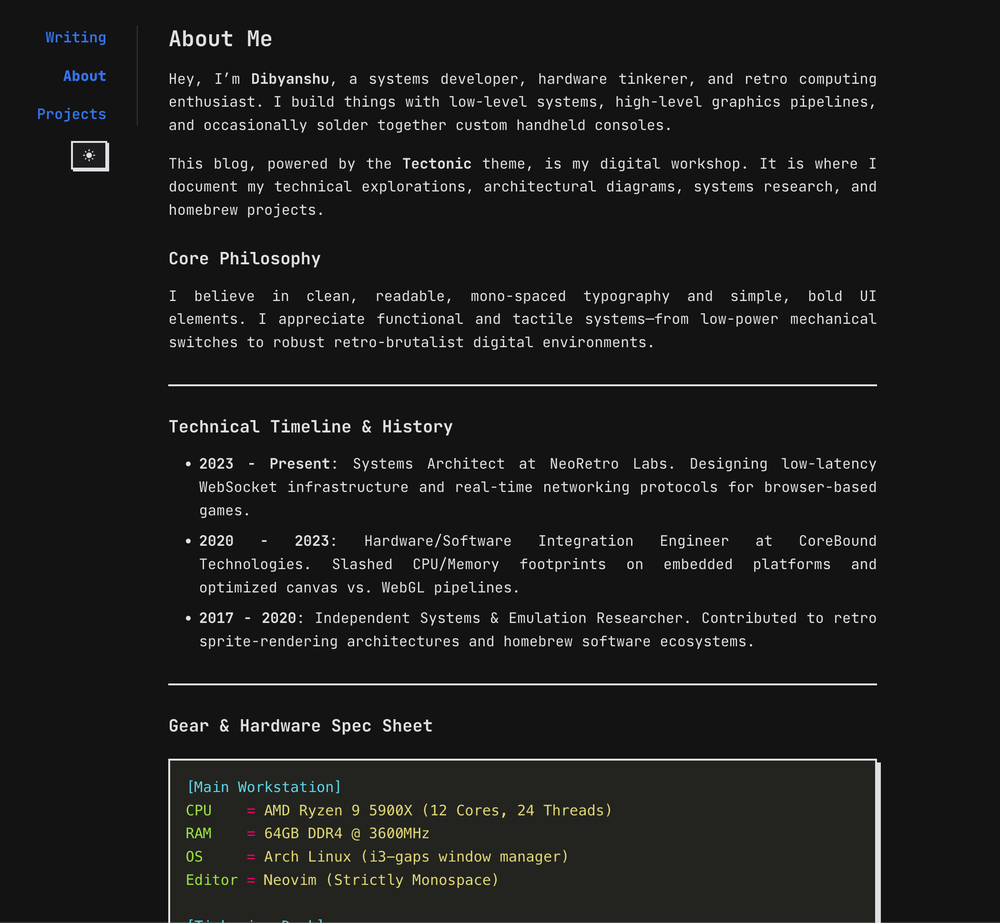
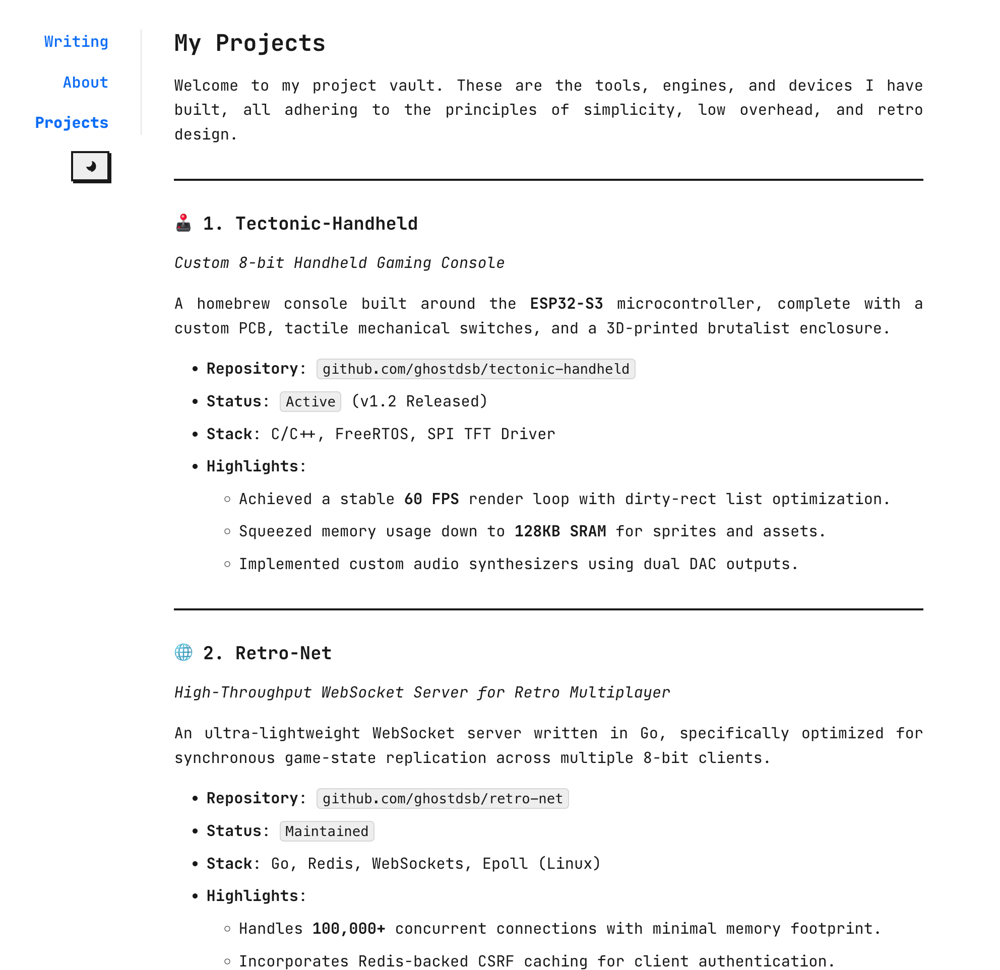

# Tectonic Hugo Theme

A clean, Neo-Brutalist Hugo theme designed for technical writing, side projects, and learnings.

| Light Mode | Dark Mode |
| :---: | :---: |
|  |  |

## Features

- **Neo-Brutalist Design:** Bold borders, high contrast, and a distinct aesthetic.
- **Dynamic Category Filtering:** Instantly filter posts on the homepage by their categories.
- **Theme Toggling:** Built-in Light and Dark mode with a persistent toggle.
- **Diagrams & Math:** Integrated support for **Mermaid.js** (diagrams) and **KaTeX** (math).
- **Responsive:** Optimized for everything from desktops to mobile devices.
- **Fast:** Zero dependencies other than the optional JS for diagrams/math.

## Quick Start

### 1. Installation

From the root of your Hugo site:

```bash
git submodule add https://github.com/ghostdsb/tectonic.git themes/tectonic
```

### 2. Configuration

Update your `hugo.toml` (or `config.toml`):

```toml
theme = "tectonic"
title = "My Tech Blog"

[params]
  author = "Your Name"
  description = "Building and learning."
  
  # Social links (optional)
  github = "https://github.com/yourusername"
  twitter = "https://twitter.com/yourusername"
  email = "hello@example.com"

[taxonomies]
  category = 'categories'
  tag = 'tags'

[markup]
  [markup.goldmark.renderer]
    unsafe = true # Required for raw HTML features
  [markup.highlight]
    noClasses = true
    style = "monokai" # Recommended for Neo-Brutalist contrast
```

### 3. Creating Content

Create a new post:

```bash
hugo new posts/my-first-post.md
```

Ensure your front matter includes categories for the homepage filter:

```markdown
---
title: "My First Post"
date: 2026-05-26
categories: ["Algorithm", "Go"]
---
```

## Special Features

### Mermaid Diagrams
Wrap your Mermaid code in a `mermaid` language block:

~~~markdown

~~~

### KaTeX Math
Use standard LaTeX delimiters:
- Inline: `$E = mc^2$`
- Block: `$$ \int_a^b x dx $$`

### Raw HTML
The theme supports raw HTML inside Markdown (ensure `unsafe = true` is in your config), which is perfect for custom alerts or layouts.

## Contributing & Bug Reports
Found a bug in the Tectonic template? Please [report it on GitHub](https://github.com/ghostdsb/hugo-theme-tectonic/issues).

## Showcase on Hugo Themes

To list this theme on the [official Hugo themes site](https://themes.gohugo.io/):

1. **Verify `theme.toml`:** Ensure the metadata in `theme.toml` is accurate.
2. **Featured Image:** The theme site requires a screenshot named `tn-featured.png` (600x400) in the `images/` directory.
3. **Submission:** Follow the [official submission guide](https://gohugo.io/hugo-themes/submitting/).

## GitHub Pages Deployment

To deploy the `exampleSite` to GitHub Pages:

1. **Enable GitHub Actions:** Go to your repository **Settings > Pages**.
2. **Build and Deployment:** Under "Build and deployment > Source", select **GitHub Actions**.
3. **Automatic Deployment:** The included `.github/workflows/gh-pages.yml` will automatically build and deploy the `exampleSite` whenever you push to the `main` branch.

The workflow automatically detects your GitHub Pages URL and sets the `baseURL` during the build process, so no manual configuration of `hugo.toml` is required for deployment.

## Previews

### About Page (Dark)


### Projects Page (Light)


## License
This theme is released under the MIT License.
