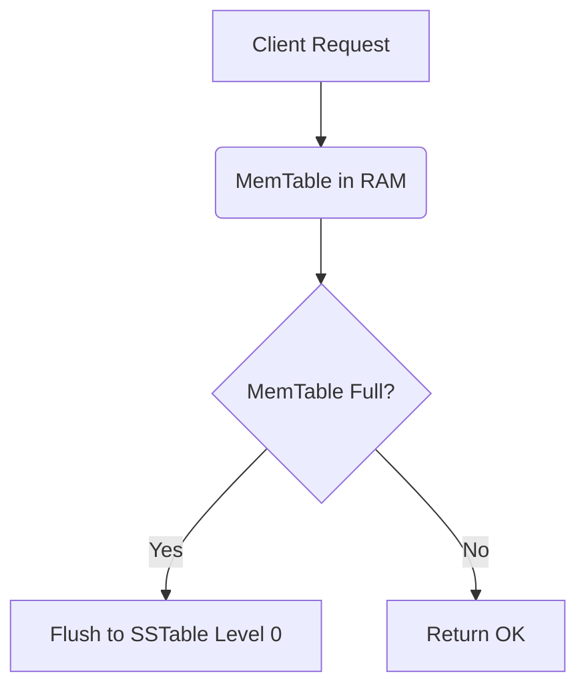

# Tectonic Hugo Theme

[](https://gohugo.io/)
[](LICENSE)
[](#design-philosophy)

**Tectonic** is a premium retro-brutalist mono-spaced Hugo theme designed specifically for developer diaries, technical blogs, systems engineering reports, and minimalist portfolios. 

It features bold, high-contrast structural borders, zero-overhead CSS, and tactile interactions, giving your site the appearance of a retro computer terminal or an interactive hardware spec sheet.

---

## ⚡ Key Features

* **Retro-Brutalist Aesthetic**: Handcrafted, pure vanilla CSS typography utilising `JetBrains Mono` and bold neo-brutalist design rules.
* **Instant Light/Dark Toggling**: A state-persisting, non-blocking theme toggler that respects system defaults with **zero FOUC** (Flash of Unstyled Content).
* **Interactive Category Filtering**: Zero-dependency frontend filtering for post lists, letting users dynamically sort through entries instantly.
* **LaTeX Equations (KaTeX)**: Full, high-performance LaTeX math rendering support built-in.
* **Responsive Diagrams (Mermaid JS)**: Built-in theme-aware Mermaid diagram support that automatically updates its color palette when you toggle between dark and light themes.
* **Clean Typographic Hierarchy**: Specially crafted layouts for standard blog articles, biographical descriptions (`about`), and chronological project portfolios (`projects`).
* **Optimized Print View**: Custom media queries that automatically strip navigation bars and toggles to generate clean, high-contrast monospace reading copies for paper or PDF printing.

---

## 🚀 Quick Start

### 1. Initialize a New Hugo Site

If you do not have an existing Hugo site, create one:

```bash
hugo new site my-blog
cd my-blog
```

### 2. Install the Theme

Install Tectonic as a Git Submodule under your site's `themes` directory:

```bash
git init
git submodule add https://github.com/ghostdsb/hugo-theme-tectonic.git themes/tectonic
```

### 3. Copy the Demo Site Configuration

The theme includes a pre-configured `exampleSite` showcase. Copy its configuration and initial content into your project directory to get started immediately:

```bash
cp themes/tectonic/exampleSite/hugo.toml .
cp -r themes/tectonic/exampleSite/content .
```

### 4. Run the Local Development Server

Launch Hugo's development server to preview your site locally:

```bash
hugo server -D
```

Navigate to `http://localhost:1313/` in your browser to explore the demo!

---

## ⚙️ Configuration (`hugo.toml`)

Below is the complete blueprint configuration detailing the custom parameters supported by Tectonic:

```toml
baseURL = "https://yourdomain.com/"
languageCode = "en-us"
title = "Tectonic Terminal"
theme = "tectonic"

# Define taxonomies for filtering
[taxonomies]
  category = "categories"
  tag = "tags"

# Main navigation menu mapping
[[menu.main]]
  name = "Home"
  url = "/"
  weight = 1

[[menu.main]]
  name = "Projects"
  url = "/projects/"
  weight = 2

[[menu.main]]
  name = "About"
  url = "/about/"
  weight = 3

# Theme-specific variables
[params]
  author = "Your Name"
  description = "A premium retro-brutalist mono-spaced Hugo theme."
  
  # Social connection keys (Renders in footer & about grid)
  github = "https://github.com/yourusername"
  twitter = "https://twitter.com/yourusername"
  linkedin = "https://linkedin.com/in/yourusername"
  email = "yourname@example.com"
```

---

## 📝 Writing Content

### Front Matter Blueprint

For standard blog posts under `content/posts/`, utilize the following YAML metadata parameters to enable tags, classifications, and description lines:

```yaml
---
title: "Deriving Bresenham's Line-Drawing Algorithm"
date: 2026-05-22T10:00:00+05:30
description: "A mathematical breakdown of Bresenham's algorithm for grid rasterization using pure integer arithmetic."
categories: ["algorithm"]
tags: ["math", "rasterization", "c"]
---
```

> [!TIP]
> The interactive filters on the homepage map directly to lower-case values of the `categories` array. Supported default categories defined in the filtering template include: `gaming`, `algorithm`, `database`, `realtime`, and `personal`.

### Adding Equations (KaTeX)

Write math using standard LaTeX formatting inside your Markdown files. 
* Use single dollar signs `$ ... $` for inline math expressions, e.g. `$E = mc^2$`.
* Use double dollar signs `$$ ... $$` for centered equation blocks:

```markdown
$$m = \frac{\Delta y}{\Delta x} = \frac{y_1 - y_0}{x_1 - x_0}$$
```

### Rendering Diagrams (Mermaid)

Embed high-fidelity charts or flowcharts using standard code-fence blocks specified with the `mermaid` language tag:

```markdown

```

---

## 📄 Custom Page Layouts

Tectonic provides dedicated structural layouts for distinct types of web content:

### 1. The About Page (`layout: about`)
Renders a grid-table of social profile icons automatically drawn from your `hugo.toml` parameters, followed by your biographical text block. Define it in `content/about.md`:

```yaml
---
title: "About Me"
layout: "about"
description: "Who is this developer?"
---
```

### 2. The Projects Page (`layout: projects`)
Optimized for tabular specifications, timelines, or listing items side-by-side using rigid brutalist grids. Define it in `content/projects.md`:

```yaml
---
title: "Open Source Projects"
layout: "projects"
description: "A list of things I have built."
---
```

---

## 🛡️ License

Tectonic is open-source software licensed under the [MIT License](LICENSE).
