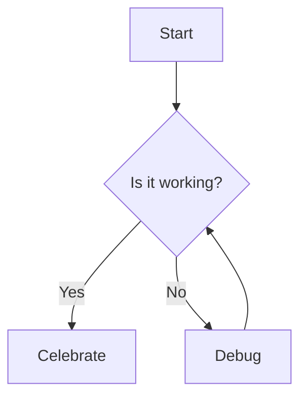

This post serves as a demonstration of the various Markdown features supported by the **Tectonic** theme.

## Text Formatting

You can use standard Markdown formatting:
- **Bold text**
- *Italic text*
- ~~Strikethrough~~
- `Inline code`
- [Link to Google](https://google.com)

## Headers

# Header 1
## Header 2
### Header 3
#### Header 4

## Lists

### Unordered
- Item 1
- Item 2
  - Subitem 2.1
  - Subitem 2.2

### Ordered
1. First
2. Second
3. Third

## Blockquotes

> "The best way to predict the future is to invent it."
> — Alan Kay

## Code Blocks

### Python
```python
def hello_world():
    print("Hello, Tectonic!")

hello_world()
```

### Rust
```rust
fn main() {
    println!("Hello, Neo-Brutalism!");
}
```

## Tables

| Feature | Support | Notes |
| :--- | :---: | :--- |
| Markdown | ✅ | Native |
| KaTeX | ✅ | Enabled in baseof.html |
| Mermaid | ✅ | Enabled in baseof.html |

## Images

The theme automatically adds a Neo-Brutalist border to all images:


*Fig 1: A placeholder image demonstrating the theme's image styling.*

## Mathematics (KaTeX)

Inline math: $E = mc^2$

Block math:
$$
\int_{a}^{b} x^2 dx = \frac{b^3 - a^3}{3}
$$

## Diagrams (Mermaid)



## Raw HTML

<div style="padding: 1rem; background: #ff4e4e; border: 3px solid #000; box-shadow: 5px 5px 0px #000; font-weight: bold;">
  This is a raw HTML div, allowed by the 'unsafe' setting in Goldmark.
</div>

## Admonitions (Handled via HTML)

<details>
<summary><b>Click to expand</b></summary>
This is hidden content using the standard HTML details/summary tags.
</details>
