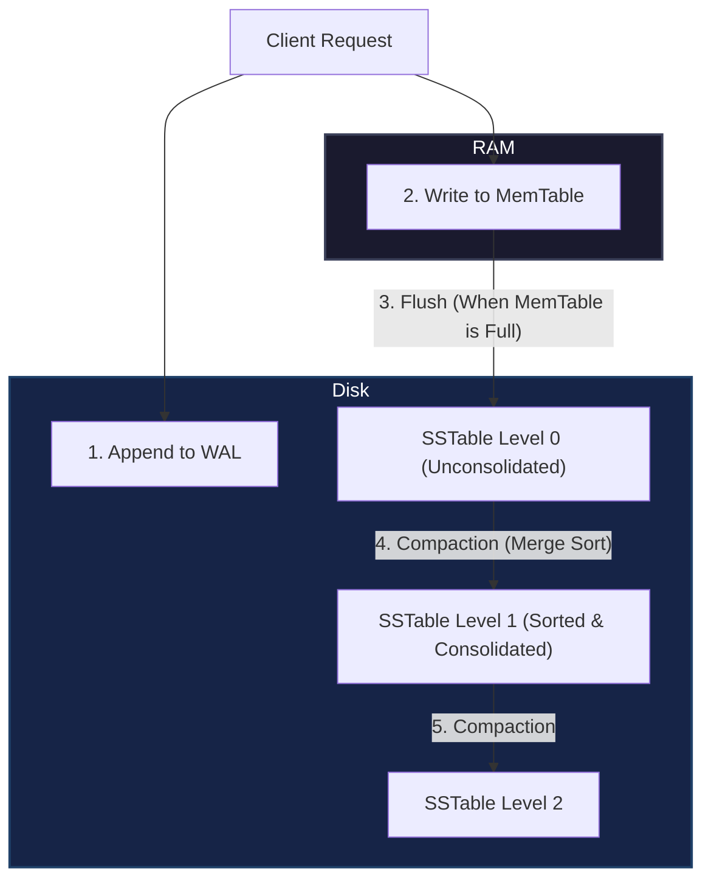

For write-intensive applications, standard B-Trees often suffer from random disk I/O, leading to severe throughput bottlenecks. **Log-Structured Merge-Trees (LSM Trees)** solve this by turning random writes into sequential writes, utilizing a hierarchical storage model.

This post dissects the architecture of an LSM Tree and illustrates the flow of data from memory to disk.

---

### Core Architecture

An LSM Tree decomposes storage into distinct components optimized for their host environment (volatile memory vs. non-volatile disk):

1. **Write-Ahead Log (WAL)**: An append-only log on disk where every write operation is recorded sequentially before being applied. This ensures durability.
2. **MemTable**: A sorted in-memory data structure (typically a SkipList or Red-Black Tree) where all recent writes and updates are held.
3. **SSTables (Sorted String Tables)**: Immutable, sorted files stored on disk. When a MemTable is filled, it is flushed to disk as an SSTable.

---

### Data Flow Diagram

The diagram below maps the write path of a key-value pair and the periodic compaction pipeline:

---

### The Compaction Process

Because SSTables are immutable, multiple versions of the same key might exist across different files on disk. To reclaim space and keep read latency low, a background worker performs **Compaction**:

* **Size-Tiered Compaction**: Compares SSTables of similar sizes. Once a threshold count of SSTables at a given level is reached, they are merged and written as a single, larger SSTable. Good for write-heavy workloads.
* **Leveled Compaction**: Divides disk space into levels ($L_1, L_2, \dots$), where the capacity of each level is ten times the previous ($10\text{MB}$, $100\text{MB}$, $1\text{GB}$). SSTables at each level have non-overlapping key ranges, maximizing read performance.

During compaction, the engine performs a streaming merge sort over the selected SSTables, keeping only the newest version of each key and weeding out deleted keys (tombstones).

---

### Advantages & Disadvantages

| Characteristic | B-Tree | LSM Tree |
| :--- | :--- | :--- |
| **Write Performance** | Random Disk I/O (Slower) | Sequential Disk I/O (Extremely Fast) |
| **Read Performance** | Point Lookups (Fastest) | Multi-file Lookup (Slower, requires Bloom filters) |
| **Space Overhead** | Fragmented (Empty slots) | Consolidated (But temp overhead during compaction) |
| **Write Amplification**| High (Rewrites full pages) | Moderate (Compaction cascades) |

By optimizing for sequential operations, LSM-Trees underpin modern high-performance databases like Cassandra, RocksDB, and LevelDB.
